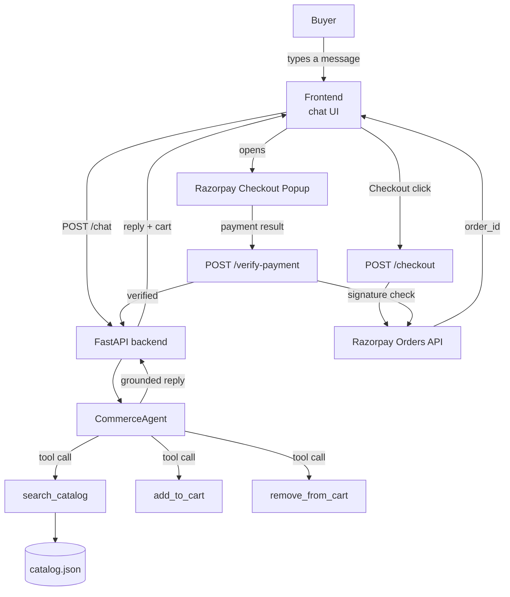

# Architecture — Agentic Checkout

**Track:** AI Growth & Agentic Commerce — Razorpay Buildathon
**Project:** A conversational shopping agent for Northwind Gadgets (fictional merchant) that lets a buyer browse, get recommendations, build a cart, and complete a real Razorpay test-mode payment — entirely through natural conversation.

---

## 1. System overview

## 2. Components

| Component | File | Responsibility |
|---|---|---|
| Chat frontend | `frontend/index.html` | Renders the conversation, sends messages, opens Razorpay's payment popup |
| API layer | `backend/main.py` | Session/cart state, catalog endpoints, checkout + payment verification |
| Commerce agent | `backend/agent/agent.py` | Wraps Claude with tool-calling; the actual "brain" of the shopping assistant |
| Catalog | `backend/data/catalog.json` | Agent-readable, schema.org-style product data (single source of truth) |
| Payments | Razorpay Orders API + Checkout.js | Test-mode order creation and payment collection |

## 3. Why tool-calling instead of free-text generation

The agent never generates product facts from its own memory. Every claim it makes about a product — price, stock, specs — comes from a `search_catalog` tool call that queries the real `catalog.json`. Cart mutations (`add_to_cart`, `remove_from_cart`) are explicit, auditable tool calls rather than the model "deciding" silently.

This was a deliberate architectural choice, not an implementation detail:

- **Grounding over generation.** An LLM asked to describe a product from memory will confidently invent specs. By forcing every product claim through a tool call against real data, the agent structurally cannot hallucinate a price or a feature — it can only ever say what's actually in the catalog. This was tested directly: asked for a product outside the catalog (a TV), the agent correctly declined rather than inventing one.
- **Auditability.** Every cart change is a discrete, loggable tool call with explicit arguments (`product_id`, `qty`) — not an opaque decision buried in generated text. This matters for a commerce agent specifically: a merchant needs to trust that "what the agent says is in the cart" and "what's actually in the cart" can never drift apart.
- **Separation of reasoning and knowledge.** The model handles intent (what does this buyer actually want, given a budget and a use case) while the catalog handles facts. This split is what makes the merchant's data swappable — a real merchant's product feed could replace `catalog.json` with zero changes to the agent's reasoning logic.

## 4. Payment flow and why verification matters

`/checkout` creates a real Razorpay order via the SDK (test mode) and returns the order ID plus the public key ID to the frontend. The frontend opens Razorpay's own hosted checkout popup — card details never touch our backend directly, which is correct practice even in test mode.

After payment, Razorpay's popup returns a `payment_id`, `order_id`, and a `signature`. The frontend sends these to `/verify-payment`, which recomputes the signature server-side using the Razorpay SDK's `verify_payment_signature`. **Only if that check passes** does the backend mark the session's purchase as complete and log the time-to-purchase metric.

This closes an obvious spoofing gap: without server-side verification, a malicious client could call the success handler directly and fake a "payment complete" state without ever paying. The signature check means the backend only trusts Razorpay's own cryptographic confirmation, not anything the browser claims happened.

## 5. Metrics

`GET /metrics` exposes:

- `sessions_started` / `sessions_completed_purchase` → conversion rate
- `fallback_rate` → percentage of agent turns that failed to produce a grounded response (API error, etc.) — a proxy for reliability
- Per-session `time_to_purchase_sec`, returned at the point of verified payment

These were chosen because they map directly to what a merchant actually cares about when evaluating an agentic commerce layer: does it convert, does it break, and is it fast.

## 6. Known limitations / what's next

- **In-memory session state.** Sessions and carts live in a Python dict, not a database — fine for a demo, not for production. Next step would be Redis or a lightweight DB for persistence across restarts.
- **Single-agent, human-in-the-loop only.** The current flow assumes a human buyer typing in a chat box. The natural extension — and the most interesting open problem in this track — is a second **buyer agent** that negotiates with this merchant agent programmatically, following a request-offer-accept pattern similar to emerging protocols like ACP, AP2, or x402. That would demonstrate actual agent-to-agent commerce, not just an AI-assisted human checkout.
- **Static catalog file.** Currently a hand-authored JSON file. A real deployment would pull from a merchant's live inventory feed — the agent's reasoning logic wouldn't need to change, only the data source.
